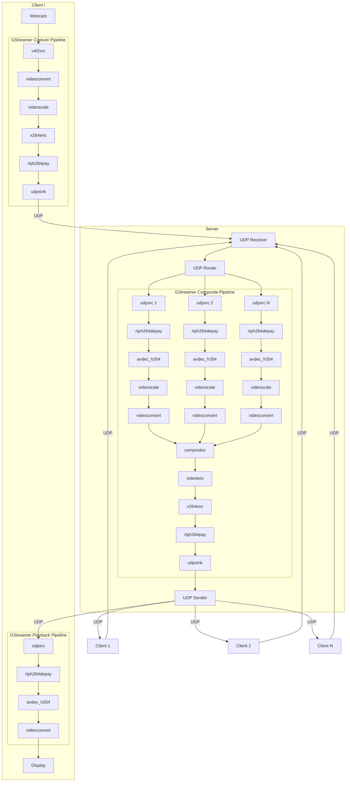

# Animatour

## About

Animatour (formerly, yet briefly, AnimaTrip) is a low-latency multi-machine video system used for effortlessly compositing video sources, such as webcams, with video inputs and the composite video output delivered over the Internet.

Animatour is influenced by [JackTrip](https://github.com/jacktrip/jacktrip) and powered by [GStreamer](https://gstreamer.freedesktop.org/).

Animatour is based on C++17, GStreamer, UDP communication, and the client-server model.

Animatour is licensed under the terms of the GNU General Public License v3.0 or later.

Animatour is in the alpha phase. The Animatour client and server are currently separate and Linux-only applications.

## Architecture



## Usage

### Animatour Server

#### Help

```bash
./animatour-server -h
# Usage: ./animatour-server [-p port]
```

#### Run Server

```bash
./animatour-server
```

### Animatour Client

#### Help

```bash
./animatour-client -h
# Usage: ./animatour-client [-r] [-t] [-d device] [-p serverport] [serverhost]
```

#### Run Webcam Client to Local Server

```bash
./animatour-client
```

or

```bash
./animatour-client -d /dev/video0
```

You may run multiple webcam clients on a single machine, but only one webcam client per webcam.

#### Run Test Client to Local Server

```bash
./animatour-client -t
```

You may run multiple test clients on a single machine.

#### Run Receive-Only (Sink-Only) Client to Local Server

```bash
./animatour-client -r
```

You may run multiple receive-only clients on a single machine.
