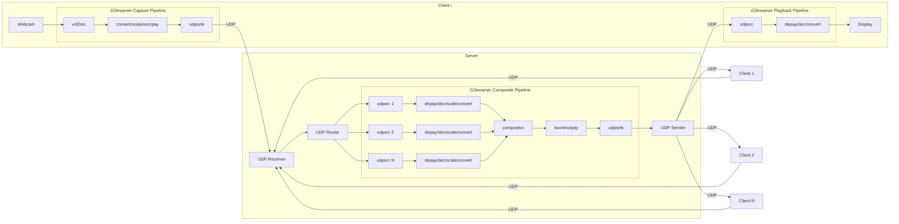

# AnimaTrip

## About

AnimaTrip is a low-latency multi-machine video system used for effortlessly compositing video sources, such as webcams, with video inputs and the composite video output delivered over the Internet.

AnimaTrip is based on UDP communication, the client-server model, C++17, and GStreamer.

AnimaTrip is heavily influenced by [JackTrip](https://github.com/jacktrip/jacktrip).

AnimaTrip is in the alpha phase. The client and the server applications are currently separate and run on Linux only.

## Architecture



## Usage

### Run server

```bash
./server
```

### Run test client that connects to local server

```bash
./client test
```

You may run multiple test clients on a single machine.

### Run webcam client that connects to local server

```bash
./client /dev/video0
```

You may run multiple webcam clients on a single machine, but only one webcam client per webcam.
